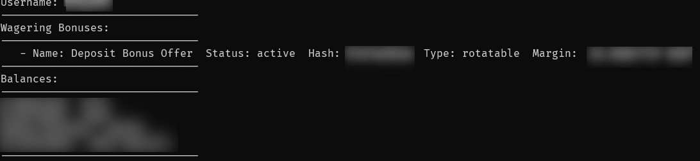
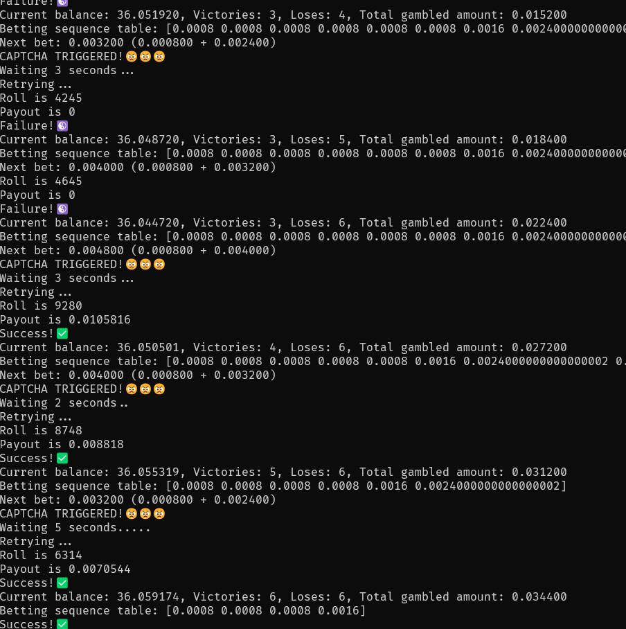

# duckdiceGoBot

duckdiceGoBot is a gambling bot for the website https://duckdice.io written in Go. It is currently limited to implementing the Labouchere betting strategy. 

## Screenshots

## Plans

For planned features look at [ToDo](ToDo.md) list.

## Features

- Currently only has CLI.
- Implements the Labouchere betting strategy for automated gambling on duckdice.io.
- Easy to configure and deploy.
- Written in Go for performance and reliability.

## Usage

1. Clone the repository:
` git clone https://github.com/dribic/duckdiceGoBot.git`
2. Save your duckdice API key into either `API` file or `API.txt` file.
3. Build the bot:
` go build`
4. Run the bot.
` ./duckdiceGoBot` on **Linux** or `duckdiceGoBot.exe` on **Windows**.

## License

This project is licensed under the GNU General Public License v3.0. See the [LICENSE](LICENSE) file for details.

## Contributing

Contributions are welcome! If you have suggestions for improvements, open an issue or create a pull request.

Your pull requests have to be based on ***devel*** branch, otherwise they will be ignored!!!

## Disclaimer

This project is in beta and may contain bugs or errors. Use it at your own risk. 

**Always exercise caution when gambling and never bet more than you can afford to lose.**

This project is a gambling bot and its use involves financial risk. The creators and contributors of duckdiceGoBot are not responsible for any losses incurred through its usage. Users are advised to gamble responsibly and within their means. This project is provided as-is, without any warranties or guarantees. 
